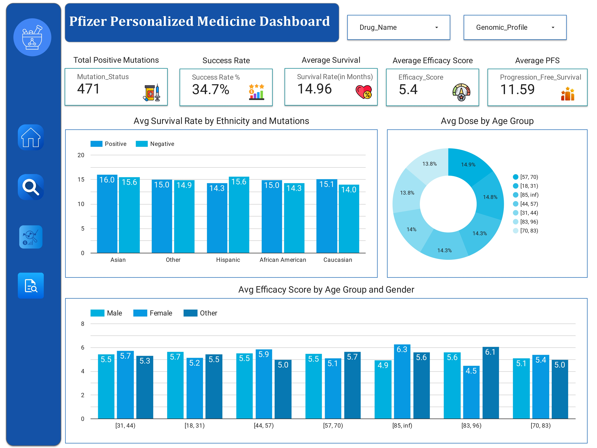

# Pfizer Personalized Medicine Initiative - Data Analysis Project

## 1. Introduction
This project focuses on Pfizer's Personalized Medicine Initiative, which aims to enhance treatment effectiveness through data-driven insights. By analyzing clinical trial and genomics data, the project seeks to identify key patient demographics, genetic factors, and drug efficacy patterns that can drive more tailored and effective treatments for diverse patient groups.

## 2. Problem Statement
The objective is to analyze Pfizer's clinical and genomic data to:
- Identify patient demographics and genetic markers that influence drug efficacy and side effect patterns.
- Optimize treatment plans by uncovering patterns in patient response variability.
- Support Pfizer in developing safer, more targeted drug formulations.

## 3. Stakeholders
- **Primary Stakeholder**: Pfizer’s R&D team, particularly those focused on precision medicine and data analytics.
- **Secondary Stakeholders**: Clinicians, data analysts, and regulatory bodies interested in the efficacy and safety of tailored treatment protocols.

## 4. Methodology
The project follows a data-driven approach to uncover actionable insights by:
- Aggregating and analyzing data on patient demographics, genetic markers, drug efficacy, and side effects.
- Using statistical analysis to identify trends in progression-free survival and success rates.
- Visualizing findings to present clear insights to non-technical stakeholders.

## 5. Tools
- **Primary Tool**: Looker Studio - utilized for visualizing data insights and facilitating clear communication with stakeholders.
- **Supporting Tools**: Excel for data cleaning and preliminary analysis.

## 6. Recommended Analysis
The analysis focuses on several key areas:
1. **Drug Efficacy by Demographics**: Understanding how age, gender, and ethnicity influence treatment outcomes.
2. **Genetic Markers and Drug Response**: Assessing how positive mutations correlate with survival rates.
3. **Side Effects by Drug**: Analyzing side effects by demographic to identify adverse reaction patterns.
4. **Dosage Optimization**: Identifying age-appropriate dosage adjustments to improve safety and efficacy.

## 7. Key Performance Indicators (KPIs)
- **Success Rate**: Percentage of patients achieving desired clinical outcomes.
- **Average Survival Rate**: Overall survival in months across treatments.
- **Progression-Free Survival (PFS)**: Average duration patients remain stable without disease progression.
- **Efficacy Score**: Average effectiveness of drugs for different demographics and genomic profiles.
- **Mutation Count**: Total number of positive mutations identified, providing insights into genetic treatment suitability.

## 8. Conclusion
The Pfizer Personalized Medicine Initiative project provides insights into tailoring drug formulations and treatment plans to individual patient profiles. Key findings suggest the potential for genomics-driven treatment plans, demographic-specific protocols, and age-adjusted dosing, ultimately supporting Pfizer’s mission of advancing precision medicine.

---

## License
This project is licensed under the MIT License. See the [LICENSE](LICENSE) file for more details.

---

## Connect with Me
- **Portfolio**: [Kunal Malviya's Portfolio](https://peerlist.io/kunalmalviya06)
- **LinkedIn**: [Kunal Malviya on LinkedIn](https://www.linkedin.com/in/kunal-malviya-0b6340289/details/skills/)
